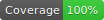
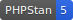

<!--

This file was written by 'WriteMarkdownCommand.php' line 34 using
SchenkeIo\PackagingTools\Markdown\MarkdownAssembler

Do not edit manually as it will be overwritten.

-->
# Laravel GZip

[](https://packagist.org/packages/schenke-io/laravel-gzip)
[](https://github.com/schenke-io/laravel-gzip/actions?query=workflow%3Arun-tests+branch%3Amain)
[](https://packagist.org/packages/schenke-io/laravel-gzip)
[]()
[]()

Laravel Facade wrapper for GZip functions.

Install

```bash
composer require schenke-io/laravel-gzip
```


